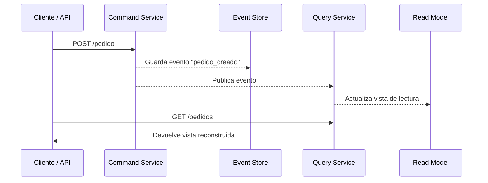
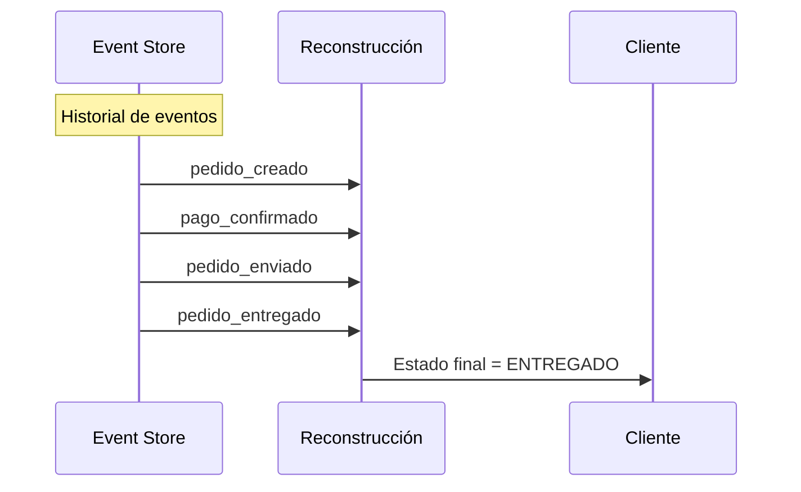

# 4.2 – Event Sourcing

---

## 🎯 Objetivo

Comprender el patrón **Event Sourcing**, su relación con CQRS y cómo permite reconstruir el estado de un sistema a partir de **eventos históricos**.
Veremos su propósito, ventajas, funcionamiento y un ejemplo funcional en Node.js.

---

## 🧩 Contexto

En el modelo tradicional, cada actualización de un recurso **sobrescribe** su valor en la base de datos.

Por ejemplo:

| Acción                       | Estado almacenado |
| ---------------------------- | ----------------- |
| Crear pedido (total 50)      | `{ total: 50 }`   |
| Actualizar pedido (total 60) | `{ total: 60 }`   |

El valor anterior se pierde, no hay historia del cambio.
Esto dificulta auditorías, rollbacks o reproducciones del sistema.

---

## ⚙️ Qué propone Event Sourcing

> En lugar de guardar solo el **estado actual**, se guarda la **secuencia de eventos** que llevaron a ese estado.

Cada cambio de estado se representa como un **evento inmutable**, y el estado actual se **reconstruye** reproduciendo esos eventos.

```text
pedido_creado → pago_confirmado → pedido_enviado → pedido_entregado
```

---

## 🧭 Flujo básico de Event Sourcing



🟦 **Command Service**: genera y persiste los eventos.
🟧 **Event Store**: almacén inmutable de eventos.
🟩 **Query Service**: reconstruye la vista de lectura procesando los eventos.

---

## 🧱 Diferencia entre CQRS y Event Sourcing

| Concepto        | CQRS                                    | Event Sourcing                                        |
| --------------- | --------------------------------------- | ----------------------------------------------------- |
| Propósito       | Separar lectura y escritura             | Persistir todos los cambios como eventos              |
| Enfoque         | Procesos de negocio                     | Persistencia de estado                                |
| Resultado final | Modelo de lectura actualizado           | Log histórico completo                                |
| Relación        | CQRS usa eventos para comunicar cambios | Event Sourcing es la fuente de verdad de esos eventos |

Ambos patrones suelen aplicarse juntos:

* CQRS → organiza las responsabilidades.
* Event Sourcing → registra cada cambio de forma inmutable.

---

## 📦 Estructura típica de eventos

Cada evento suele tener la forma:

```json
{
  "id": "evt-1730780000123",
  "tipo": "pedido_creado",
  "timestamp": "2025-11-04T10:12:00Z",
  "data": {
    "pedidoId": 101,
    "cliente": "Ana",
    "total": 120.5
  }
}
```

---

## 🧩 Ejemplo funcional – Node.js

A continuación, un ejemplo sencillo que muestra cómo guardar eventos y reconstruir el estado de un pedido desde ellos.

### 🗃️ events-store.js

Simula un almacén de eventos en memoria:

```js
// events-store.js
export const eventStore = [];

export function saveEvent(evento) {
  eventStore.push(evento);
  console.log("💾 Evento guardado:", evento.tipo);
}

export function getEventsByPedido(id) {
  return eventStore.filter(e => e.data.pedidoId === id);
}
```

---

### 🧠 reconstruct.js

Reconstruye el estado actual de un pedido reproduciendo los eventos:

```js
// reconstruct.js
import { getEventsByPedido } from "./events-store.js";

export function reconstruirPedido(pedidoId) {
  const eventos = getEventsByPedido(pedidoId);
  const estado = { id: pedidoId, estado: "DESCONOCIDO", total: 0 };

  for (const ev of eventos) {
    switch (ev.tipo) {
      case "pedido_creado":
        estado.estado = "CREADO";
        estado.total = ev.data.total;
        break;
      case "pago_confirmado":
        estado.estado = "PAGADO";
        break;
      case "pedido_enviado":
        estado.estado = "ENVIADO";
        break;
      case "pedido_entregado":
        estado.estado = "ENTREGADO";
        break;
    }
  }
  return estado;
}
```

---

### ⚙️ commands-service.js

```js
// commands-service.js
import express from "express";
import { saveEvent } from "./events-store.js";

const app = express();
app.use(express.json());

app.post("/pedido", (req, res) => {
  const evento = {
    id: "evt-" + Date.now(),
    tipo: "pedido_creado",
    timestamp: new Date().toISOString(),
    data: { pedidoId: Date.now(), cliente: req.body.cliente, total: req.body.total }
  };
  saveEvent(evento);
  res.json({ status: "ok", evento });
});

app.post("/pedido/:id/pago", (req, res) => {
  const evento = {
    id: "evt-" + Date.now(),
    tipo: "pago_confirmado",
    timestamp: new Date().toISOString(),
    data: { pedidoId: parseInt(req.params.id) }
  };
  saveEvent(evento);
  res.json({ status: "ok", evento });
});

app.listen(4000, () => console.log("🟦 Commands Service en puerto 4000"));
```

---

### 📄 queries-service.js

```js
// queries-service.js
import express from "express";
import { reconstruirPedido } from "./reconstruct.js";

const app = express();

app.get("/pedido/:id", (req, res) => {
  const estado = reconstruirPedido(parseInt(req.params.id));
  res.json(estado);
});

app.listen(4001, () => console.log("🟧 Queries Service en puerto 4001"));
```

---

### 🧪 Prueba interactiva

```bash
# Crear pedido
curl -X POST http://localhost:4000/pedido \
  -H "Content-Type: application/json" \
  -d '{"cliente": "Ana", "total": 120.5}'

# Confirmar pago
curl -X POST http://localhost:4000/pedido/1730780/pago

# Consultar estado actual
curl http://localhost:4001/pedido/1730780
```

📜 El sistema reconstruye el estado final leyendo los eventos guardados.

---

## 🔁 Flujo de reconstrucción visual



---

## 🧠 Ventajas de Event Sourcing

| Ventaja                          | Descripción                                                |
| -------------------------------- | ---------------------------------------------------------- |
| **Auditoría completa**           | Permite ver el historial exacto de lo ocurrido.            |
| **Reproducibilidad**             | Puedes reconstruir cualquier estado pasado.                |
| **Integración natural con CQRS** | Los eventos alimentan el modelo de lectura.                |
| **Escalabilidad**                | Los servicios pueden suscribirse a los eventos relevantes. |

---

## ⚠️ Desafíos comunes

| Reto                   | Solución habitual                                  |
| ---------------------- | -------------------------------------------------- |
| Tamaño del historial   | Implementar *snapshots* periódicos.                |
| Migraciones de esquema | Versionar los tipos de evento.                     |
| Complejidad inicial    | Automatizar el almacenamiento y replay de eventos. |

---

## 💬 Analogía docente

> Imagina que una base de datos tradicional es una **fotografía** del momento actual,
> mientras que Event Sourcing es **una película completa**: puedes ver cómo llegaste a ese estado, avanzar o retroceder en el tiempo.

---

## 🔚 Conclusión

El patrón **Event Sourcing** aporta:

* Trazabilidad total.
* Reconstrucción del estado histórico.
* Integración fluida con CQRS.

En el siguiente apartado (4.3) llevaremos esto a la práctica en un laboratorio real con **Event Store + CQRS funcional en Node.js y RabbitMQ**, donde se observará la persistencia y reconstrucción de eventos en tiempo real.