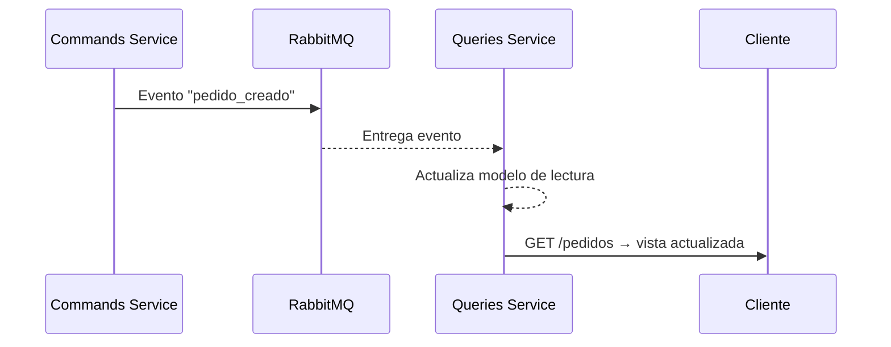

# 4.3 – 🧪 Laboratorio: CQRS y Event Sourcing

---

## 🎯 Objetivos

* Aplicar de forma práctica los conceptos de **CQRS** y **Event Sourcing**.
* Observar cómo los **comandos** generan eventos y cómo los **servicios de consulta** reconstruyen el estado.
* Comprender el concepto de **consistencia eventual** en entornos distribuidos.
* Ejercitar la depuración y trazabilidad de eventos mediante **RabbitMQ**.

---

## 🧱 Estructura del laboratorio

```
LABS/cqrs_event_sourcing/
├── docker-compose.yml
├── commands-service/
│   └── index.js
├── queries-service/
│   └── index.js
└── events-store/
    └── store.js
```

---

## 🐳 Paso 1 — Crear el entorno `docker-compose.yml`

Guarda este archivo como:
`LABS/cqrs_event_sourcing/docker-compose.yml`

```yaml
version: "3.9"

services:
  rabbitmq:
    image: rabbitmq:3-management
    container_name: rabbitmq
    ports:
      - "5672:5672"
      - "15672:15672"

  commands-service:
    image: node:22
    container_name: commands-service
    working_dir: /app
    volumes:
      - ./commands-service:/app
    command: bash -c "npm install express amqplib && node index.js"
    environment:
      - RABBITMQ_URL=amqp://rabbitmq
    ports:
      - "5000:5000"
    depends_on:
      - rabbitmq

  queries-service:
    image: node:22
    container_name: queries-service
    working_dir: /app
    volumes:
      - ./queries-service:/app
    command: bash -c "npm install express amqplib && node index.js"
    environment:
      - RABBITMQ_URL=amqp://rabbitmq
    ports:
      - "5001:5001"
    depends_on:
      - rabbitmq
```

---

## ⚙️ Paso 2 — Servicio de Comandos

Guarda este archivo como
`LABS/cqrs_event_sourcing/commands-service/index.js`

```js
import express from "express";
import amqp from "amqplib";

const app = express();
app.use(express.json());
const RABBITMQ_URL = process.env.RABBITMQ_URL || "amqp://rabbitmq";
const EXCHANGE = "eventos_pedidos";

// Función para publicar un evento
async function publicarEvento(evento) {
  const conn = await amqp.connect(RABBITMQ_URL);
  const ch = await conn.createChannel();
  await ch.assertExchange(EXCHANGE, "fanout", { durable: true });
  ch.publish(EXCHANGE, "", Buffer.from(JSON.stringify(evento)));
  console.log("📤 Evento publicado:", evento.tipo);
  await ch.close();
  await conn.close();
}

// POST /pedido → genera evento "pedido_creado"
app.post("/pedido", async (req, res) => {
  const pedido = {
    id: Date.now(),
    cliente: req.body.cliente,
    total: req.body.total,
    estado: "CREADO"
  };

  const evento = {
    tipo: "pedido_creado",
    timestamp: new Date().toISOString(),
    data: pedido
  };

  await publicarEvento(evento);
  res.json({ status: "ok", evento });
});

app.listen(5000, () => console.log("🟦 Commands Service en puerto 5000"));
```

---

## 🟧 Paso 3 — Servicio de Consultas

Guarda este archivo como
`LABS/cqrs_event_sourcing/queries-service/index.js`

```js
import express from "express";
import amqp from "amqplib";

const app = express();
let pedidos = [];
const RABBITMQ_URL = process.env.RABBITMQ_URL || "amqp://rabbitmq";
const EXCHANGE = "eventos_pedidos";

// Escuchar eventos del bus y mantener vista actualizada
async function escucharEventos() {
  const conn = await amqp.connect(RABBITMQ_URL);
  const ch = await conn.createChannel();
  await ch.assertExchange(EXCHANGE, "fanout", { durable: true });

  const q = await ch.assertQueue("cola_pedidos", { durable: false });
  await ch.bindQueue(q.queue, EXCHANGE, "");

  console.log("📥 Query Service escuchando eventos...");

  ch.consume(q.queue, msg => {
    const evento = JSON.parse(msg.content.toString());
    console.log("🔄 Evento recibido:", evento.tipo);

    if (evento.tipo === "pedido_creado") {
      pedidos.push(evento.data);
    }

    ch.ack(msg);
  });
}

// Endpoint de lectura
app.get("/pedidos", (req, res) => {
  res.json({ total: pedidos.length, data: pedidos });
});

escucharEventos();
app.listen(5001, () => console.log("🟧 Queries Service en puerto 5001"));
```

---

## 🧩 Paso 4 — Simulación del Event Store

Para simplificar el laboratorio, RabbitMQ actuará como “bus de eventos”,
pero puedes añadir una carpeta `events-store/` con un simple archivo local que guarde los eventos en memoria o disco si quieres persistencia:

`LABS/cqrs_event_sourcing/events-store/store.js`

```js
export const events = [];
export function save(evento) {
  events.push(evento);
  console.log("💾 Guardado en Event Store:", evento.tipo);
}
export function all() { return events; }
```

*(Opcional: se puede integrar en el Commands Service si se desea auditar los eventos localmente.)*

---

## 🧪 Paso 5 — Pruebas del flujo

1️⃣ **Levanta el entorno:**

```bash
docker compose up
```

2️⃣ **Crea un pedido (comando):**

```bash
curl -X POST http://localhost:5000/pedido \
  -H "Content-Type: application/json" \
  -d '{"cliente":"David","total":150.5}'
```

3️⃣ **Consulta los pedidos (query):**

```bash
curl http://localhost:5001/pedidos
```

✅ Verás algo como:

```json
{
  "total": 1,
  "data": [
    {
      "id": 1730781630001,
      "cliente": "David",
      "total": 150.5,
      "estado": "CREADO"
    }
  ]
}
```

---

## 🧠 Qué observar

| Elemento           | Función                                         |
| ------------------ | ----------------------------------------------- |
| `commands-service` | Publica eventos al crear pedidos                |
| `RabbitMQ`         | Distribuye los eventos                          |
| `queries-service`  | Escucha eventos y mantiene su modelo de lectura |
| `GET /pedidos`     | Devuelve el estado reconstruido                 |

---

## 🔁 Flujo CQRS + Event Sourcing



---

## 📊 Comparativa práctica

| Enfoque               | Lectura           | Escritura           | Persistencia             | Consistencia             |
| --------------------- | ----------------- | ------------------- | ------------------------ | ------------------------ |
| Monolítico            | Mismo modelo      | Mismo modelo        | Base de datos relacional | Inmediata                |
| CQRS                  | Modelos separados | Modelos separados   | Eventos in-memory        | Eventual                 |
| CQRS + Event Sourcing | Modelos separados | Eventos persistidos | Event Store              | Eventual + Auditabilidad |

---

## 🔚 Conclusión

Con este laboratorio has puesto en práctica:

* El patrón **CQRS**, separando escritura y lectura.
* El patrón **Event Sourcing**, persistiendo el flujo de eventos.
* El concepto de **consistencia eventual** entre ambos mundos.
* El uso de **RabbitMQ** como bus de eventos distribuidos.

🎯 Resultado: un sistema distribuido trazable, extensible y resiliente.