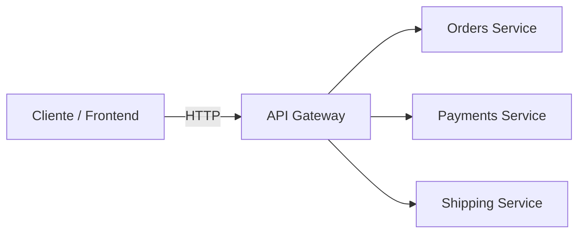
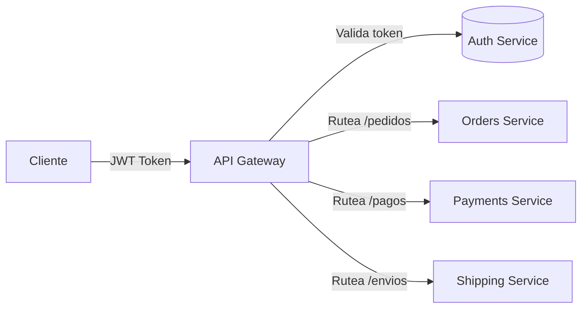
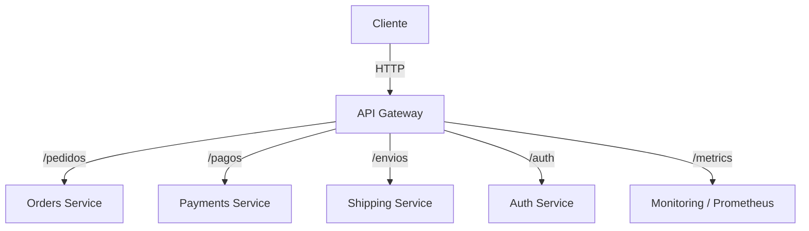

# 5.1 – API Gateway

---

## 🎯 Objetivo

Comprender el rol del **API Gateway** dentro de una arquitectura de microservicios:
cómo actúa como **punto de entrada único**, aplica políticas de seguridad, balancea tráfico, unifica respuestas y reduce la complejidad del cliente.

---

## 🧩 Contexto

En una arquitectura de microservicios, cada servicio suele exponer su propia API:

* `orders-service` → `/pedidos`
* `payments-service` → `/pagos`
* `shipping-service` → `/envios`

Esto obliga al cliente (frontend o app móvil) a:

* conocer las URLs de todos los servicios,
* autenticarse varias veces,
* manejar formatos o políticas distintas.

Para simplificar este escenario, introducimos un **API Gateway**.

---

## ⚙️ ¿Qué es un API Gateway?

> Es un **punto único de entrada** que centraliza el acceso a todos los microservicios del sistema.

Su función principal es **recibir las peticiones de los clientes, enrutar, agregar, autenticar o transformar** las solicitudes antes de entregarlas a los servicios internos.

---

## 🧭 Esquema general



👉 El cliente solo habla con **G (Gateway)**,
y este se encarga de comunicarse con los microservicios internos.

---

## 🧱 Funciones clave del API Gateway

| Categoría                        | Función                                      | Ejemplo                            |
| -------------------------------- | -------------------------------------------- | ---------------------------------- |
| **Ruteo**                        | Reenvía las peticiones al servicio correcto. | `/api/pedidos → orders-service`    |
| **Agregación**                   | Combina datos de varios servicios.           | `/api/dashboard → pedidos + pagos` |
| **Autenticación / Autorización** | Valida tokens (JWT, OAuth2, API Keys).       | Header `Authorization`             |
| **Rate limiting**                | Controla el número de peticiones.            | Evita abusos o DDoS                |
| **Caché**                        | Guarda respuestas recientes.                 | Respuestas GET                     |
| **Transformación**               | Unifica formatos de respuesta.               | JSON normalizado                   |
| **Seguridad**                    | Añade HTTPS, CORS, validaciones.             | Configuración centralizada         |

---

## 💡 Ventajas

✅ **Centraliza la seguridad y autenticación.**
✅ **Simplifica el acceso para los clientes.**
✅ **Permite control de tráfico y políticas.**
✅ **Aísla los cambios internos de los servicios.**
✅ **Mejora la trazabilidad y logging centralizado.**

---

## ⚠️ Desventajas

⚠️ Puede convertirse en un **punto único de fallo** si no se replica.
⚠️ Añade una **latencia adicional** en cada petición.
⚠️ Su configuración y mantenimiento requieren cuidado.
⚠️ Debe diseñarse para **no convertirse en un “monolito de red”**.

---

## 🔐 Patrón común: Gateway + Authentication + Routing



---

## 🧩 Ejemplo funcional: Gateway con Express

A continuación, un ejemplo básico de API Gateway escrito en **Node.js + Express**.
Este gateway recibe peticiones y las reenvía a servicios internos mediante `axios`.

### 📄 `gateway.js`

```js
import express from "express";
import axios from "axios";

const app = express();
app.use(express.json());

// Configuración de rutas hacia los microservicios
const ROUTES = {
  pedidos: "http://orders-service:3000",
  pagos: "http://payments-service:3001",
  envios: "http://shipping-service:3002"
};

// Middleware simple de logging
app.use((req, res, next) => {
  console.log(`➡️  ${req.method} ${req.originalUrl}`);
  next();
});

// Middleware de autenticación (ejemplo simplificado)
app.use((req, res, next) => {
  const token = req.headers.authorization;
  if (!token) return res.status(401).json({ error: "Falta token JWT" });
  // Aquí podríamos validar el JWT contra un Auth Service
  next();
});

// Ruteo dinámico hacia servicios internos
app.all("/api/:servicio/*", async (req, res) => {
  const { servicio } = req.params;
  const destino = ROUTES[servicio];
  if (!destino) return res.status(404).json({ error: "Servicio no encontrado" });

  const pathInterno = req.originalUrl.replace(`/api/${servicio}`, "");
  const url = `${destino}${pathInterno}`;

  try {
    const respuesta = await axios({
      method: req.method,
      url,
      data: req.body,
      headers: { Authorization: req.headers.authorization }
    });
    res.status(respuesta.status).json(respuesta.data);
  } catch (err) {
    console.error("❌ Error al reenviar petición:", err.message);
    res.status(500).json({ error: "Error interno del gateway" });
  }
});

app.listen(4000, () => console.log("🚪 API Gateway escuchando en puerto 4000"));
```

---

## 🧪 Flujo de prueba conceptual

```bash
# 1. Cliente envía token y crea pedido
curl -X POST http://localhost:4000/api/pedidos/crear \
  -H "Authorization: Bearer 1234" \
  -H "Content-Type: application/json" \
  -d '{"cliente":"Ana","total":120.5}'

# 2. Gateway valida el token y reenvía al servicio interno:
# http://orders-service:3000/crear
```

---

## 📊 Gateway dentro de una arquitectura distribuida



💡 Así el Gateway se convierte en el **front controller** de todos los servicios.

---

## 🧠 Patrones avanzados

| Patrón                         | Descripción                                        | Ejemplo                        |
| ------------------------------ | -------------------------------------------------- | ------------------------------ |
| **BFF (Backend for Frontend)** | Un gateway especializado por cliente o canal.      | Uno para web, otro para móvil. |
| **Edge Gateway**               | Gateway expuesto en la frontera pública de la red. | HTTPS / CDN / rate limit.      |
| **Service Mesh Gateway**       | Integrado en Istio / Linkerd, usa sidecars.        | Control de tráfico interno.    |

---

## 🔐 Integración con autenticación JWT

En el módulo **5.4 – Laboratorio Gateway y JWT**,
implementaremos un **API Gateway real con autenticación JWT**,
donde cada microservicio validará tokens firmados y el Gateway aplicará middleware de seguridad, control de acceso y logging centralizado.

---

## 🔚 Conclusión

El **API Gateway** es un componente esencial en las arquitecturas modernas:

* simplifica la comunicación entre cliente y microservicios,
* centraliza seguridad y ruteo,
* facilita la observabilidad y la integración con otros servicios (auth, logs, métricas).

Es el punto ideal para **unificar control, autenticación y resiliencia**,
pero debe diseñarse con cuidado para no convertirse en un **cuello de botella**.