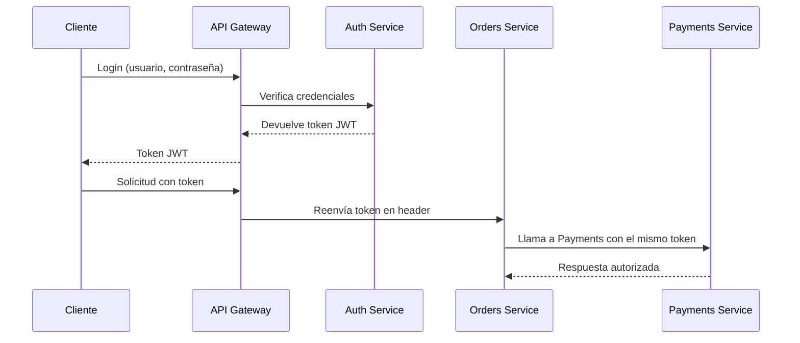
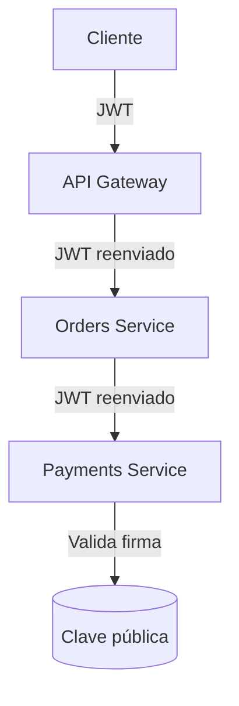
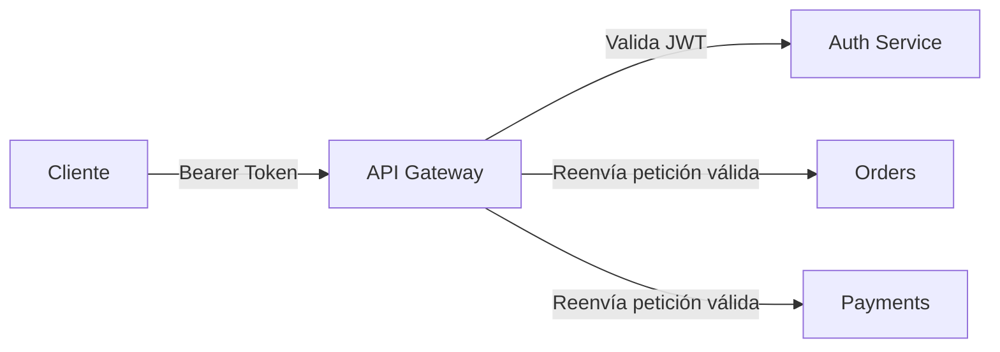

# 5.2 – Seguridad distribuida en microservicios

---

## 🎯 Objetivo

Comprender cómo se gestiona la **seguridad en entornos distribuidos**,
donde múltiples microservicios deben autenticarse y autorizar operaciones sin depender de un único proceso central.

Aprenderás:

* Qué significa **autenticación** y **autorización** en un sistema distribuido.
* Cómo funciona la propagación de identidad con **JWT (JSON Web Tokens)**.
* Patrones de **seguridad interservicios**.
* Buenas prácticas para evitar fugas o accesos indebidos.

---

## 🧩 Contexto

En una aplicación monolítica, la autenticación suele ser sencilla:

* un único backend,
* una sesión por usuario,
* control de acceso centralizado.

En microservicios, cada servicio es independiente, lo que introduce nuevos retos:

* Cada servicio expone endpoints propios.
* El tráfico puede pasar por un Gateway, balanceadores o colas.
* Es necesario **propagar la identidad del usuario** de forma segura.

---

## ⚙️ Conceptos clave

| Concepto                     | Descripción                                     |
| ---------------------------- | ----------------------------------------------- |
| **Autenticación (AuthN)**    | Verifica la identidad del usuario o servicio.   |
| **Autorización (AuthZ)**     | Determina qué puede hacer esa identidad.        |
| **Confidencialidad**         | Los datos viajan cifrados (HTTPS, TLS).         |
| **Integridad**               | Se evita la manipulación de mensajes.           |
| **Propagación de identidad** | Cómo los servicios “saben” quién es el usuario. |

---

## 🧭 Esquema básico: seguridad entre servicios



🟦 El cliente obtiene un **JWT** firmado.
🟧 El token viaja en los headers HTTP.
🟩 Cada microservicio valida el token antes de procesar la petición.

---

## 🔐 JSON Web Tokens (JWT)

Un **JWT** es un token firmado digitalmente que contiene la identidad y permisos del usuario.

Formato:

```
header.payload.signature
```

Ejemplo:

```json
{
  "sub": "user123",
  "role": "admin",
  "iat": 1730791200,
  "exp": 1730794800
}
```

---

### 🧩 Verificación típica de un JWT

1. Se comprueba la **firma** con una clave secreta.
2. Se valida la **fecha de expiración (exp)**.
3. Se usa el **payload** para decisiones de autorización.

---

## ⚙️ Ejemplo funcional – Validación JWT en Node.js

### 📄 `auth-service.js`

Servicio de autenticación que genera tokens JWT.

```js
import express from "express";
import jwt from "jsonwebtoken";

const app = express();
app.use(express.json());
const SECRET = "CLAVE_SUPER_SECRETA"; // en práctica → variable de entorno

app.post("/login", (req, res) => {
  const { usuario, password } = req.body;

  if (usuario === "admin" && password === "1234") {
    const token = jwt.sign(
      { sub: usuario, rol: "admin" },
      SECRET,
      { expiresIn: "1h" }
    );
    res.json({ token });
  } else {
    res.status(401).json({ error: "Credenciales inválidas" });
  }
});

app.listen(3005, () => console.log("🔐 Auth Service en puerto 3005"));
```

---

### 📄 `orders-service.js`

Servicio protegido que valida el token recibido.

```js
import express from "express";
import jwt from "jsonwebtoken";

const app = express();
const SECRET = "CLAVE_SUPER_SECRETA";

function verificarToken(req, res, next) {
  const header = req.headers.authorization;
  if (!header) return res.status(401).json({ error: "Falta token" });

  const token = header.split(" ")[1];
  try {
    req.usuario = jwt.verify(token, SECRET);
    next();
  } catch (e) {
    res.status(401).json({ error: "Token inválido o expirado" });
  }
}

app.get("/pedidos", verificarToken, (req, res) => {
  res.json({ usuario: req.usuario.sub, pedidos: ["A123", "B456"] });
});

app.listen(3006, () => console.log("📦 Orders Service en puerto 3006"));
```

---

### 🧪 Prueba del flujo

```bash
# 1️⃣ Solicitar token
curl -X POST http://localhost:3005/login \
  -H "Content-Type: application/json" \
  -d '{"usuario":"admin","password":"1234"}'

# 2️⃣ Guardar token devuelto
TOKEN="eyJhbGciOiJIUzI1NiIsInR5cCI..."

# 3️⃣ Acceder al servicio protegido
curl -H "Authorization: Bearer $TOKEN" http://localhost:3006/pedidos
```

✅ Verás una respuesta autorizada:

```json
{
  "usuario": "admin",
  "pedidos": ["A123", "B456"]
}
```

---

## 🧱 Seguridad inter-servicios

Además de los usuarios humanos, los **microservicios también deben autenticarse entre sí**.
Existen tres enfoques principales:

| Enfoque               | Descripción                                         | Ejemplo                      |
| --------------------- | --------------------------------------------------- | ---------------------------- |
| **Token compartido**  | Todos los servicios usan una clave o token interno. | Header `X-Internal-Auth`     |
| **JWT de servicio**   | Cada servicio tiene su propio token firmado.        | Claims tipo `service:orders` |
| **mTLS (mutual TLS)** | Cifrado de doble autenticación entre certificados.  | `client.crt` y `server.crt`  |

---

## 🔄 Propagación de identidad



El **JWT viaja a lo largo de toda la cadena** para mantener el contexto del usuario.
Cada servicio valida la firma sin necesidad de consultar al Auth Service.

---

## ⚠️ Buenas prácticas

✅ Usar **HTTPS obligatorio** para todo tráfico.
✅ Mantener las **claves privadas fuera del código** (usarlas desde variables de entorno o Secret Manager).
✅ Establecer **tiempos de expiración cortos** en los tokens.
✅ Implementar **rotación de claves (key rotation)** periódica.
✅ Registrar (log) únicamente **metadatos seguros**, nunca el token completo.
✅ Aislar el tráfico interno con **Service Mesh (Istio, Linkerd)** o **NetworkPolicies**.

---

## 🔐 Relación con el API Gateway

El Gateway puede asumir parte de la seguridad:

* Validar tokens antes de reenviar las peticiones.
* Rechazar tráfico no autenticado.
* Agregar o propagar cabeceras JWT.
* Centralizar el CORS, rate limiting y logs.



---

## 🧠 Analogía docente

> Imagina una empresa donde cada empleado tiene una **tarjeta de acceso digital (JWT)**.
> El **vigilante del edificio (API Gateway)** revisa la tarjeta al entrar,
> pero dentro del edificio cada puerta (microservicio) puede verificarla de nuevo antes de abrir.

---

## 🔚 Conclusión

La **seguridad distribuida** no consiste solo en proteger endpoints,
sino en diseñar un sistema donde **la identidad y el permiso viajen con cada solicitud**.

**JWT**, **HTTPS** y **API Gateways** son herramientas clave para lograrlo.
En el siguiente laboratorio (5.4), implementaremos un **Gateway real con validación JWT**
para consolidar estos conceptos de forma práctica.
