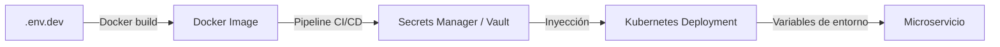

# 5.3 – Configuración y secretos en entornos distribuidos

---

## 🎯 Objetivo

Aprender cómo **gestionar configuraciones y secretos de forma segura** en sistemas distribuidos,
manteniendo la separación entre **código, entorno y credenciales**.

---

## 🧩 Contexto

Cada microservicio necesita **configuración propia**:

* puertos, URIs, claves API, tokens, credenciales de base de datos, etc.

Si todo esto se guarda directamente en el código fuente:
❌ es difícil cambiar valores,
❌ se exponen datos sensibles,
❌ se rompen despliegues al cambiar de entorno (dev, test, prod).

Por eso se externaliza la configuración mediante **variables de entorno, ficheros o servicios externos**.

---

## ⚙️ Tipos de configuración

| Tipo                               | Ejemplo                                | Nivel de sensibilidad |
| ---------------------------------- | -------------------------------------- | --------------------- |
| **Parámetros de entorno**          | `PORT=5000`, `LOG_LEVEL=debug`         | Bajo                  |
| **Configuración de conexión**      | `DB_HOST`, `REDIS_URL`                 | Medio                 |
| **Credenciales o tokens**          | `DB_PASSWORD`, `JWT_SECRET`, `API_KEY` | Alto                  |
| **Certificados y claves privadas** | `tls.crt`, `service-account.pem`       | Crítico               |

---

## 🧠 Principios fundamentales

1. **Separar configuración del código.**
2. **No almacenar secretos en repositorios.**
3. **Versionar configuración genérica, no sensible.**
4. **Usar inyección de variables por entorno.**
5. **Cifrar los valores confidenciales en tránsito y reposo.**

---

## 🧱 12-Factor App – Configuración por entorno

El principio número 3 de las [12-Factor Apps](https://12factor.net/config) establece:

> “Almacena la configuración en el entorno, no en el código.”

Ejemplo en Node.js:

```js
// index.js
const PORT = process.env.PORT || 3000;
const DB_HOST = process.env.DB_HOST;
const DB_PASSWORD = process.env.DB_PASSWORD;

console.log(`Conectando a ${DB_HOST} con contraseña ${DB_PASSWORD ? "***" : "(no definida)"}`);
```

Y en ejecución:

```bash
DB_HOST=db.example.com DB_PASSWORD=secreto node index.js
```

---

## 🧭 Configuración en Docker

### 🧩 Variables en `docker-compose.yml`

```yaml
services:
  orders-service:
    image: node:22
    environment:
      - PORT=3000
      - DB_HOST=db
      - DB_PASSWORD=${ORDERS_DB_PASSWORD}
```

El valor `${ORDERS_DB_PASSWORD}` se carga desde un fichero `.env` local,
nunca se escribe directamente en el YAML.

---

### 📄 Ejemplo de `.env`

```bash
ORDERS_DB_PASSWORD=S3guro_2025!
PAYMENTS_API_KEY=12345-abcde
```

Y se añade **al `.gitignore`** para evitar exponerlo en el repositorio:

```
# Evitar exponer secretos
.env
*.pem
*.crt
```

---

## ☸️ Configuración en Kubernetes

Kubernetes gestiona la configuración con **ConfigMaps** y **Secrets**.

---

### 🧩 ConfigMap – configuración no sensible

```yaml
apiVersion: v1
kind: ConfigMap
metadata:
  name: orders-config
data:
  APP_MODE: "production"
  LOG_LEVEL: "info"
```

---

### 🔐 Secret – datos sensibles (base64)

```yaml
apiVersion: v1
kind: Secret
metadata:
  name: orders-secrets
type: Opaque
data:
  DB_PASSWORD: c2VndXJvX3Bhc3N3b3Jk # "seguro_password" codificado en base64
```

---

### 📦 Usar ConfigMaps y Secrets en un Pod

```yaml
apiVersion: apps/v1
kind: Deployment
metadata:
  name: orders-service
spec:
  replicas: 1
  template:
    spec:
      containers:
        - name: orders
          image: orders:latest
          envFrom:
            - configMapRef:
                name: orders-config
            - secretRef:
                name: orders-secrets
```

Kubernetes inyecta las claves como variables de entorno dentro del contenedor.

---

## 🧠 Estrategias avanzadas

| Estrategia                      | Descripción                                   | Ejemplo de uso                        |
| ------------------------------- | --------------------------------------------- | ------------------------------------- |
| **Vault (HashiCorp Vault)**     | Servicio centralizado de gestión de secretos. | Cifrado dinámico de claves y tokens.  |
| **AWS Secrets Manager**         | Almacena y rota secretos automáticamente.     | Credenciales de RDS o API Keys.       |
| **Parameter Store (SSM)**       | Configuración jerárquica gestionada por AWS.  | Variables `/prod/orders/db/password`. |
| **Sealed Secrets (Kubernetes)** | Cifra los Secrets directamente en YAML.       | DevOps seguro con GitOps.             |

---

## 🧩 Ejemplo práctico – Configuración segura por entorno

Supongamos tres entornos:

| Entorno  | Configuración | Descripción                                       |
| -------- | ------------- | ------------------------------------------------- |
| **Dev**  | `.env.dev`    | Valores locales y fijos                           |
| **Test** | `.env.test`   | Variables de staging                              |
| **Prod** | `.env.prod`   | Claves reales cifradas o gestionadas externamente |

Los pipelines CI/CD pueden inyectar los ficheros apropiados al construir la imagen Docker.

---

### 🧰 Ejemplo de build CI/CD

```yaml
# .github/workflows/deploy.yml
name: Deploy Orders Service

on:
  push:
    branches: [ main ]

jobs:
  deploy:
    runs-on: ubuntu-latest
    steps:
      - name: Checkout
        uses: actions/checkout@v4

      - name: Cargar configuración
        run: |
          echo "DB_PASSWORD=${{ secrets.DB_PASSWORD }}" >> .env

      - name: Construir imagen
        run: docker build -t orders-service:latest .

      - name: Desplegar a Kubernetes
        run: kubectl apply -f k8s/
```

GitHub **inyecta los secretos cifrados** definidos en el repositorio.

---

## 🧩 Ejemplo visual: ciclo de vida de la configuración



---

## ⚠️ Riesgos y mitigaciones

| Riesgo                          | Mitigación                                         |
| ------------------------------- | -------------------------------------------------- |
| Secretos en repositorio         | Añadir `.env` al `.gitignore`.                     |
| Logs con datos sensibles        | Filtrar información en middleware o logs.          |
| Rotación insuficiente de claves | Automatizar rotación periódica.                    |
| Fuga por imágenes Docker        | Usar `ARG` o `--build-arg` sin persistir secretos. |
| Permisos excesivos en pods      | Aplicar RBAC y políticas mínimas.                  |

---

## 🧠 Analogía docente

> Imagina que cada microservicio es un empleado de una empresa.
> La **configuración** es su uniforme (ajustable según el puesto).
> Los **secretos** son su tarjeta de acceso (personal e intransferible).
> Cada empleado recibe su uniforme y tarjeta al incorporarse, pero nadie las guarda en la carpeta de recursos humanos (el código fuente).

---

## 🔚 Conclusión

Una buena gestión de configuración y secretos:

* Permite desplegar el mismo código en distintos entornos.
* Protege datos sensibles frente a fugas.
* Facilita la automatización en CI/CD y GitOps.
* Refuerza la seguridad y mantenibilidad global del sistema.

---

📘 En el siguiente laboratorio (**5.4 – Práctica: Gateway y JWT**),
verás cómo aplicar estos principios en la práctica:
el Gateway cargará su configuración desde variables y validará tokens JWT de forma centralizada.