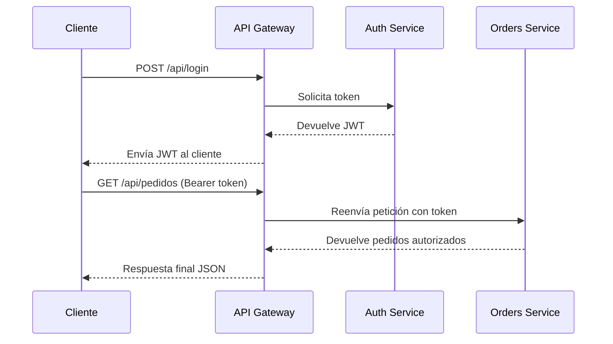

# 5.4 – 🧪 Laboratorio: API Gateway y Seguridad JWT

---

## 🎯 Objetivos

* Implementar un **API Gateway** que centraliza el acceso a varios microservicios.
* Integrar un **Auth Service** que emite tokens JWT.
* Aplicar validación y propagación del token en el flujo de peticiones.
* Comprobar cómo los servicios internos confían en el Gateway y en el token firmado.

---

## 🧱 Estructura del laboratorio

```
LABS/gateway_jwt/
├── docker-compose.yml
├── gateway/
│   └── index.js
├── auth-service/
│   └── index.js
└── orders-service/
    └── index.js
```

---

## ⚙️ Paso 1 — `docker-compose.yml`

Guarda este archivo como
`LABS/gateway_jwt/docker-compose.yml`

```yaml
version: "3.9"

services:
  gateway:
    image: node:22
    container_name: gateway
    working_dir: /app
    volumes:
      - ./gateway:/app
    command: bash -c "npm install express axios jsonwebtoken && node index.js"
    ports:
      - "4000:4000"
    environment:
      - AUTH_URL=http://auth-service:3005
      - ORDERS_URL=http://orders-service:3006
    depends_on:
      - auth-service
      - orders-service

  auth-service:
    image: node:22
    container_name: auth-service
    working_dir: /app
    volumes:
      - ./auth-service:/app
    command: bash -c "npm install express jsonwebtoken && node index.js"
    ports:
      - "3005:3005"

  orders-service:
    image: node:22
    container_name: orders-service
    working_dir: /app
    volumes:
      - ./orders-service:/app
    command: bash -c "npm install express jsonwebtoken && node index.js"
    ports:
      - "3006:3006"
```

---

## 🔐 Paso 2 — `auth-service/index.js`

Servicio de autenticación: genera y valida tokens JWT.

```js
import express from "express";
import jwt from "jsonwebtoken";

const app = express();
app.use(express.json());

const SECRET = "CLAVE_SUPER_SECRETA";

app.post("/login", (req, res) => {
  const { usuario, password } = req.body;
  if (usuario === "admin" && password === "1234") {
    const token = jwt.sign({ sub: usuario, rol: "admin" }, SECRET, { expiresIn: "1h" });
    res.json({ token });
  } else {
    res.status(401).json({ error: "Credenciales inválidas" });
  }
});

app.get("/verify", (req, res) => {
  const header = req.headers.authorization;
  if (!header) return res.status(401).json({ error: "Falta token" });

  try {
    const token = header.split(" ")[1];
    const payload = jwt.verify(token, SECRET);
    res.json(payload);
  } catch {
    res.status(401).json({ error: "Token inválido" });
  }
});

app.listen(3005, () => console.log("🔐 Auth Service en puerto 3005"));
```

---

## 📦 Paso 3 — `orders-service/index.js`

Servicio protegido que solo responde a peticiones autenticadas.

```js
import express from "express";
import jwt from "jsonwebtoken";

const app = express();
const SECRET = "CLAVE_SUPER_SECRETA";

function verificarToken(req, res, next) {
  const header = req.headers.authorization;
  if (!header) return res.status(401).json({ error: "Falta token" });
  const token = header.split(" ")[1];

  try {
    req.usuario = jwt.verify(token, SECRET);
    next();
  } catch {
    res.status(401).json({ error: "Token inválido o expirado" });
  }
}

app.get("/pedidos", verificarToken, (req, res) => {
  res.json({
    usuario: req.usuario.sub,
    pedidos: [
      { id: 101, producto: "Portátil", total: 1200 },
      { id: 102, producto: "Teclado", total: 80 }
    ]
  });
});

app.listen(3006, () => console.log("📦 Orders Service en puerto 3006"));
```

---

## 🚪 Paso 4 — `gateway/index.js`

API Gateway: centraliza peticiones y valida tokens antes de reenviar.

```js
import express from "express";
import axios from "axios";
import jwt from "jsonwebtoken";

const app = express();
app.use(express.json());

const AUTH_URL = process.env.AUTH_URL || "http://auth-service:3005";
const ORDERS_URL = process.env.ORDERS_URL || "http://orders-service:3006";
const SECRET = "CLAVE_SUPER_SECRETA";

// Middleware para logging
app.use((req, res, next) => {
  console.log(`➡️  ${req.method} ${req.originalUrl}`);
  next();
});

// Ruta de login: se comunica con Auth Service
app.post("/api/login", async (req, res) => {
  try {
    const respuesta = await axios.post(`${AUTH_URL}/login`, req.body);
    res.json(respuesta.data);
  } catch {
    res.status(401).json({ error: "Credenciales inválidas" });
  }
});

// Middleware de validación de JWT
app.use(async (req, res, next) => {
  if (req.path.startsWith("/api/login")) return next();

  const header = req.headers.authorization;
  if (!header) return res.status(401).json({ error: "Falta token" });

  const token = header.split(" ")[1];
  try {
    jwt.verify(token, SECRET);
    next();
  } catch {
    res.status(401).json({ error: "Token inválido" });
  }
});

// Ruteo hacia Orders Service
app.get("/api/pedidos", async (req, res) => {
  try {
    const respuesta = await axios.get(`${ORDERS_URL}/pedidos`, {
      headers: { Authorization: req.headers.authorization }
    });
    res.json(respuesta.data);
  } catch {
    res.status(500).json({ error: "Error interno del Gateway" });
  }
});

app.listen(4000, () => console.log("🚪 API Gateway escuchando en puerto 4000"));
```

---

## 🧪 Paso 5 — Pruebas del flujo

1️⃣ **Levanta el entorno:**

```bash
docker compose up
```

2️⃣ **Obtén un token de autenticación:**

```bash
curl -X POST http://localhost:4000/api/login \
  -H "Content-Type: application/json" \
  -d '{"usuario":"admin","password":"1234"}'
```

3️⃣ **Guarda el token devuelto:**

```bash
TOKEN="eyJhbGciOiJIUzI1NiIsInR5cCI6..."
```

4️⃣ **Accede al servicio protegido a través del Gateway:**

```bash
curl -H "Authorization: Bearer $TOKEN" http://localhost:4000/api/pedidos
```

✅ Respuesta esperada:

```json
{
  "usuario": "admin",
  "pedidos": [
    { "id": 101, "producto": "Portátil", "total": 1200 },
    { "id": 102, "producto": "Teclado", "total": 80 }
  ]
}
```

---

## 🧭 Flujo visual completo



---

## 🧠 Observa

| Componente         | Función                                       |
| ------------------ | --------------------------------------------- |
| **Auth Service**   | Genera y firma el JWT                         |
| **Gateway**        | Punto de entrada, valida tokens y enruta      |
| **Orders Service** | Solo responde si el token es válido           |
| **JWT**            | Propaga identidad del usuario entre servicios |

---

## ⚠️ Buenas prácticas aplicadas

✅ Uso de variables de entorno (`AUTH_URL`, `ORDERS_URL`).
✅ Validación y propagación de tokens en cada capa.
✅ Separación clara de responsabilidades (Auth, Gateway, Service).
✅ Comunicación interna por red Docker (`auth-service`, `orders-service`).

---

## 🧩 Extensiones posibles

* Añadir un **Payments Service** protegido.
* Implementar **roles** (`rol: admin`) y control de acceso granular.
* Integrar **HTTPS** con certificados autocontenidos.
* Añadir **logging centralizado** o métricas Prometheus.

---

## 🔚 Conclusión

Este laboratorio cierra el módulo 5 demostrando:

* cómo un **API Gateway** controla la seguridad y ruteo,
* cómo los **tokens JWT** viajan entre microservicios,
* y cómo se garantiza un acceso seguro, extensible y trazable.